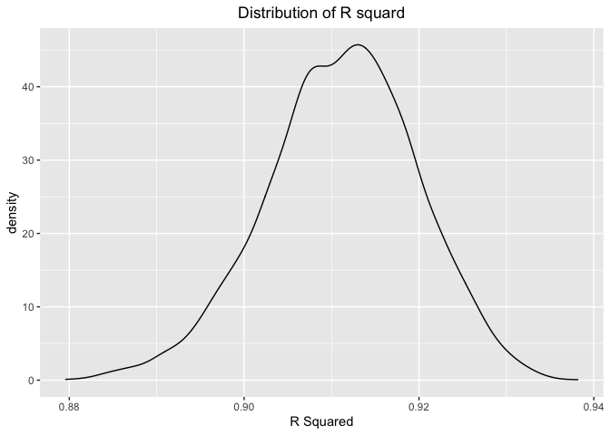

p8105\_hw6\_qc2307
================
Qixiang Chen
12/3/2021

``` r
library(tidyverse)
```

    ## ── Attaching packages ─────────────────────────────────────── tidyverse 1.3.1 ──

    ## ✓ ggplot2 3.3.5     ✓ purrr   0.3.4
    ## ✓ tibble  3.1.4     ✓ dplyr   1.0.7
    ## ✓ tidyr   1.1.3     ✓ stringr 1.4.0
    ## ✓ readr   2.0.1     ✓ forcats 0.5.1

    ## ── Conflicts ────────────────────────────────────────── tidyverse_conflicts() ──
    ## x dplyr::filter() masks stats::filter()
    ## x dplyr::lag()    masks stats::lag()

``` r
library(modelr)
library(ggplot2)
library(p8105.datasets)
library(plotly)
```

    ## 
    ## Attaching package: 'plotly'

    ## The following object is masked from 'package:ggplot2':
    ## 
    ##     last_plot

    ## The following object is masked from 'package:stats':
    ## 
    ##     filter

    ## The following object is masked from 'package:graphics':
    ## 
    ##     layout

## Problem 1

#### Step1: Load in data and clean.

``` r
df_regression = read_csv("./birthweight.csv") %>%
  janitor::clean_names() %>%
  mutate(
    babysex = as.factor(babysex),
    frace = as.factor(frace),
    malform = as.factor(malform),
    mrace = as.factor(mrace)
  ) 
```

    ## Rows: 4342 Columns: 20

    ## ── Column specification ────────────────────────────────────────────────────────
    ## Delimiter: ","
    ## dbl (20): babysex, bhead, blength, bwt, delwt, fincome, frace, gaweeks, malf...

    ## 
    ## ℹ Use `spec()` to retrieve the full column specification for this data.
    ## ℹ Specify the column types or set `show_col_types = FALSE` to quiet this message.

``` r
df_regression
```

    ## # A tibble: 4,342 × 20
    ##    babysex bhead blength   bwt delwt fincome frace gaweeks malform menarche
    ##    <fct>   <dbl>   <dbl> <dbl> <dbl>   <dbl> <fct>   <dbl> <fct>      <dbl>
    ##  1 2          34      51  3629   177      35 1        39.9 0             13
    ##  2 1          34      48  3062   156      65 2        25.9 0             14
    ##  3 2          36      50  3345   148      85 1        39.9 0             12
    ##  4 1          34      52  3062   157      55 1        40   0             14
    ##  5 2          34      52  3374   156       5 1        41.6 0             13
    ##  6 1          33      52  3374   129      55 1        40.7 0             12
    ##  7 2          33      46  2523   126      96 2        40.3 0             14
    ##  8 2          33      49  2778   140       5 1        37.4 0             12
    ##  9 1          36      52  3515   146      85 1        40.3 0             11
    ## 10 1          33      50  3459   169      75 2        40.7 0             12
    ## # … with 4,332 more rows, and 10 more variables: mheight <dbl>, momage <dbl>,
    ## #   mrace <fct>, parity <dbl>, pnumlbw <dbl>, pnumsga <dbl>, ppbmi <dbl>,
    ## #   ppwt <dbl>, smoken <dbl>, wtgain <dbl>

#### Step2: Test whether there is NA or not.

``` r
purrr::map(df_regression, ~ sum(is.na(.)))
```

    ## $babysex
    ## [1] 0
    ## 
    ## $bhead
    ## [1] 0
    ## 
    ## $blength
    ## [1] 0
    ## 
    ## $bwt
    ## [1] 0
    ## 
    ## $delwt
    ## [1] 0
    ## 
    ## $fincome
    ## [1] 0
    ## 
    ## $frace
    ## [1] 0
    ## 
    ## $gaweeks
    ## [1] 0
    ## 
    ## $malform
    ## [1] 0
    ## 
    ## $menarche
    ## [1] 0
    ## 
    ## $mheight
    ## [1] 0
    ## 
    ## $momage
    ## [1] 0
    ## 
    ## $mrace
    ## [1] 0
    ## 
    ## $parity
    ## [1] 0
    ## 
    ## $pnumlbw
    ## [1] 0
    ## 
    ## $pnumsga
    ## [1] 0
    ## 
    ## $ppbmi
    ## [1] 0
    ## 
    ## $ppwt
    ## [1] 0
    ## 
    ## $smoken
    ## [1] 0
    ## 
    ## $wtgain
    ## [1] 0

Description of modeling process: Firstly, I loaded in the data. As the
requirement, some variables need to be converted into factors, so I
firstly converted `babysex`, `frace`, `malform`, and `mrace` from double
to factor. Then, I checked if there is any NA in each variable. I found
there was no NA in this dataframe.

#### Step3: Propose a regression model for birthweight and show a plot of model residuals against fitted values

``` r
model1 = lm(bwt ~ delwt + fincome + gaweeks + malform + momage + mrace + parity, data = df_regression)
model1
```

    ## 
    ## Call:
    ## lm(formula = bwt ~ delwt + fincome + gaweeks + malform + momage + 
    ##     mrace + parity, data = df_regression)
    ## 
    ## Coefficients:
    ## (Intercept)        delwt      fincome      gaweeks     malform1       momage  
    ##    232.6451       5.7284       0.4852      55.0823     -43.7908      -1.6003  
    ##      mrace2       mrace3       mrace4       parity  
    ##   -244.1631      14.0346    -101.0271     117.5454

``` r
df_regression %>%
  add_residuals(model1) %>%
  add_predictions(model1) %>%
  ggplot(aes(x = pred, y = resid)) + 
  geom_point(alpha = 0.5) + 
  geom_smooth(se = F, color = "blue", method = "lm") + 
  labs(
    x = "residuals", 
    y = "predictions",
    title = "Prediction vs. Residuals"
  ) + 
  theme(plot.title = element_text(hjust = 0.5))
```

    ## `geom_smooth()` using formula 'y ~ x'

<!-- -->
Comment: For the first regression model, I have chosen the variables
that may directly affect the baby’s birth weight according to materials
online, including `delwt`, `fincome`, `gaweeks`, `malform`, `momage`,
`mrace`, `parity`, which are mother’s weight at delivery, family monthly
income, gestational age in weeks, presence of malformations that could
affect weight, mother’s age at delivery, mother’s race, number of live
births prior to this pregnancy, respectively.

#### Step4: Propose two other functions:

``` r
model2 = lm(bwt ~ blength + gaweeks, data = df_regression)
model3 = lm(bwt ~ blength + bhead + babysex +  bhead * babysex + blength * babysex + blength * bhead, data = df_regression)
```

#### Step5: Cross Valiation

``` r
df_cv = 
  crossv_mc(df_regression, 100) %>%
  mutate(
    training_set = map(train, as_tibble),
    testing_set = map(test, as_tibble)
  ) %>%
  mutate(
    model1 = map(.x = training_set, ~lm(bwt ~ delwt + fincome + gaweeks + malform + momage + mrace + parity, data = .x)),
    model2 = map(.x = training_set, ~lm(bwt ~ gaweeks + blength + delwt, data = .x)),
    model3 = map(.x = training_set, ~lm(bwt ~ gaweeks + bhead + menarche + wtgain + blength + bhead * blength, data = .x))
  ) %>%
  mutate(
    model1_rmse = map2_dbl(.x = model1, .y = testing_set, ~rmse(model = .x, data = .y)),
    model2_rmse = map2_dbl(.x = model2, .y = testing_set, ~rmse(model = .x, data = .y)),
    model3_rmse = map2_dbl(.x = model3, .y = testing_set, ~rmse(model = .x, data = .y))
  ) 
```

    ## Warning in predict.lm(model, data): prediction from a rank-deficient fit may be
    ## misleading

#### Step6: Plot of RMSE

``` r
df_cv %>%
  select(model1_rmse, model2_rmse, model3_rmse) %>%
  pivot_longer(
    model1_rmse:model3_rmse,
    names_to = "model",
    values_to = "rmse"
  ) %>%
  ggplot(aes(x = model, y = rmse)) +
  geom_violin()
```

<!-- -->
Comment: According to the graph derived, we know that here the model3
fits best among the three models since it has the lowest rmse among the
three models. Maybe it is because of there are three interactions in
model 3.

## Problem 2

Step1: load in data

``` r
weather_df = 
  rnoaa::meteo_pull_monitors(
    c("USW00094728"),
    var = c("PRCP", "TMIN", "TMAX"), 
    date_min = "2017-01-01",
    date_max = "2017-12-31") %>%
  mutate(
    name = recode(id, USW00094728 = "CentralPark_NY"),
    tmin = tmin / 10,
    tmax = tmax / 10) %>%
  select(name, id, everything())
```

    ## Registered S3 method overwritten by 'hoardr':
    ##   method           from
    ##   print.cache_info httr

    ## using cached file: ~/Library/Caches/R/noaa_ghcnd/USW00094728.dly

    ## date created (size, mb): 2021-11-05 11:20:00 (7.611)

    ## file min/max dates: 1869-01-01 / 2021-11-30

Step2: bootstrap

``` r
set.seed(12345)
boot_sample = function(df) {
  sample_frac(df, replace = TRUE)
}
boot_straps = 
  data_frame(
    strap_number = 1:5000,
    strap_sample = rerun(5000, boot_sample(weather_df))
  )
```

    ## Warning: `data_frame()` was deprecated in tibble 1.1.0.
    ## Please use `tibble()` instead.
    ## This warning is displayed once every 8 hours.
    ## Call `lifecycle::last_warnings()` to see where this warning was generated.

results:

``` r
boot_results = 
  boot_straps %>%
  mutate(
    models = map(.x = strap_sample, ~lm(tmax ~ tmin, data = .x)),
    results = map(models, broom::glance)
  ) %>%
  select(strap_number, results) %>%
  unnest(results)
```

R^2

``` r
p_r_square = 
  boot_results %>%
  ggplot(aes(x = adj.r.squared)) +
  geom_density() +
  labs(
    title = "Distribution of R squard",
    x = "R Squared"
  ) +
  theme(plot.title = element_text(hjust = 0.5))
p_r_square
```

<!-- -->
Comment:The distribution is about normal. The center is around R^2 =
0.91. The 95% confidence interval is (0.8929929, 0.9271882)

Log function

``` r
bootstrap2 = weather_df %>%
  bootstrap(5000, id = "strap_num") %>%
  mutate(
    models = map(.x = strap, ~lm(tmax ~ tmin, data = .x)),
    results = map(models, broom::tidy)
  ) %>%
  select(strap_num, results) %>%
  unnest(results) %>%
  select(term, estimate) %>%
  pivot_wider(
    names_from = term,
    values_from = estimate
  ) %>%
  unnest(cols = c(`(Intercept)`, tmin)) %>%
  rename(
    beta0 = "(Intercept)",
    beta1 = tmin
  ) %>%
  mutate(
    log_function = log(beta0 * beta1)
  )
```

    ## Warning: Values are not uniquely identified; output will contain list-cols.
    ## * Use `values_fn = list` to suppress this warning.
    ## * Use `values_fn = length` to identify where the duplicates arise
    ## * Use `values_fn = {summary_fun}` to summarise duplicates

plot

``` r
bootstrap2 %>%
  ggplot(aes(x = log_function)) + 
  geom_density() + 
  labs(x = "Log Function",
       title = "distribution") + 
  theme(plot.title = element_text(hjust = 0.5))
```

<!-- -->
Comment: The distribution of log function is about normal. The center is
around 2.01. The 95% confidence interval is (1.9675018, 2.059247)
